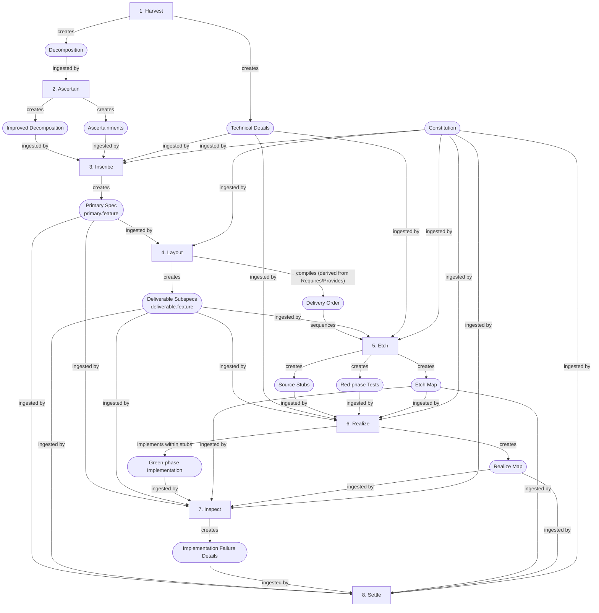

# Artifact Specifications

Format and lifecycle specifications for every artifact the pipeline produces. Each spec defines the artifact's structure, content rules, which stages write and read it, and where it lives on disk. Together they form the data model that inspection checks and the traceability gate verify against.

## Project-Wide Artifacts

Persistent artifacts that apply across all features. Written once and updated as the project evolves. Live under `.haileris/project/`.

| Spec | Purpose | Key Stages |
|------|---------|------------|
| [Constitution](constitution.md) | Architectural principles every stage enforces | User-created; Inscribe through Settle (read) |
| [Project Standards](project-standards.md) | Coding standards, conventions, framework choices | Harvest (write), Inscribe through Settle (read) |
| [Pipeline Config](config.md) | Retry limits and auto-fix behavior | User-created; Etch, Realize, Settle, Layout (read) |

## Feature-Scoped Artifacts

Per-feature artifacts that accumulate as a feature moves through the pipeline. Live under `.haileris/features/{feature_id}/`.

| Spec | Purpose | Key Stages |
|------|---------|------------|
| [Decomposition](decomposition.md) | Plain-English distillation of feature and delivery context | Harvest (write), Ascertain + Inscribe (read) |
| [Ascertainments](ascertainments.md) | Ambiguities surfaced during Ascertain and their resolutions | Ascertain (write), Inscribe + Settle (read/append) |
| [Technical Details](technical-details.md) | Synthesized technical context: standards, dependencies, file inventory | Harvest (write), Inscribe + Etch + Realize (read) |
| [Delivery Order](delivery-order.md) | Sequenced YAML list of subspecs with dependency edges | Layout (write), Etch + Realize (read), Settle (regenerate) |
| [Etch Map](etch-map.md) | BID-to-test-function mapping with qualified test paths | Etch (write), Realize + Inspect (read), Settle (update) |
| [Realize Map](realize-map.md) | BID-to-derivation mapping (functions, methods, classes) | Realize (write), Inspect + Settle (read) |
| [Pipeline State](pipeline-state.md) | Machine-readable record of where the feature sits in the pipeline | All stages (read/write) |
| [Inspection Reports](inspection-reports.md) | Machine-readable YAML from validation gates (Harvest, Layout, Etch, Realize) | Harvest through Realize (write), Inspect (read) |
| [Verify Report](verify-report.md) | User-readable summary of Inspect findings with pass/fail status | Inspect (write), Settle (read) |

## Source Tree Artifacts

Artifacts that live in the repository's source and test directories rather than under `.haileris/`.

| Spec | Purpose | Location | Key Stages |
|------|---------|----------|------------|
| [Spec](spec.md) | Gherkin feature files defining integration and unit-level contracts | `tests/features/{feature_id}/` | Inscribe (write), Layout through Inspect (read) |
| [Tests](tests.md) | Red-phase test suite with one test per BID in AAA format | `tests/unit/`, `tests/integration/` | Etch (write), Realize + Inspect + Settle (read) |
| [Implementation](implementation.md) | Production code scoped strictly to spec BIDs | `src/` | Etch (stubs), Realize (implement within stubs), Inspect + Settle (read) |

## Pipeline Internals

| Spec | Purpose |
|------|---------|
| [Pipeline Defaults](pipeline-defaults.md) | Baseline conventions applied when project-level artifacts are absent |

## Artifact Creation and Ingestion

## Conventions

### Artifact Paths

All paths use forward slashes and are relative to the project root. The three standard base paths:

- **Feature directory**: `.haileris/features/{feature_id}/`
- **Project directory**: `.haileris/project/`
- **Spec directory**: `tests/features/{feature_id}/`

### BID Traceability

BIDs (`BID-{NNN}`) are the atomic unit of traceability. Artifacts that carry BID references — etch maps, realize maps, inspection reports — must use the canonical format so the traceability gate at Inspect can link them end-to-end.

### Lifecycle

Artifacts follow a produce-then-verify pattern: a stage writes an artifact, a downstream inspection validates it, and the traceability gate at Inspect confirms cross-artifact consistency. The four inspection reports (Harvest, Layout, Etch, Realize) feed directly into the gate.
