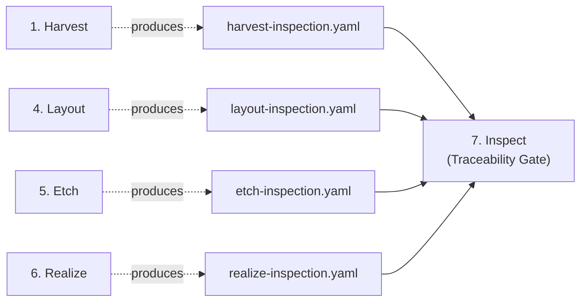

# Automation Specifications

Precise, language-agnostic behavioral specifications for the pipeline's mechanical verification layers. Each spec defines inputs, behavioral specifications, outputs, and edge cases with enough precision that any implementation — in any language — produces identical results on identical inputs. Checks without mechanical specs are still mandatory pipeline behaviors — the pipeline agent evaluates them using judgment.

## Tier 1: Fully Mechanical (M)

High frequency, high error cost, low implementation difficulty. Each spec below covers the mechanical checks; agent-evaluated checks within these inspections are listed in [Checks Without Mechanical Specifications](#checks-without-mechanical-specifications). Source: [investment map](../../.notes/mechanical/investment-map.md) items 1–5.

| Spec | Operations | Source |
|------|-----------|--------|
| [Harvest Inspection](harvest-inspection.md) | 3 mechanically verified, 1 agent-evaluated | [harvest.md](../stages/harvest.md) |
| [Layout Inspection](layout-inspection.md) | 4 mechanically verified, 1 agent-evaluated | [layout.md](../stages/layout.md) |
| [Etch Inspection](etch-inspection.md) | 3 mechanically verified, 2 agent-evaluated | [etch.md](../stages/etch.md) |
| [Realize Inspection](realize-inspection.md) | 2 mechanically verified, 1 constraint-gated | [realize.md](../stages/realize.md) |
| [Traceability Gate](traceability-gate.md) | 5 checks | [inspect.md](../stages/inspect.md) |
| [ANLZ-003](anlz-003.md) | 1 check (5-step algorithm) | [layout.md](../stages/layout.md) |
| [ANLZ-005](anlz-005.md) | 1 check (6-step algorithm) | [layout.md](../stages/layout.md) |
| [ANLZ-006](anlz-006.md) | 1 check (4-step algorithm) | [layout.md](../stages/layout.md) |
| [TEST-001](test-001.md) | 1 check | [etch.md](../stages/etch.md) |
| [Pipeline State](pipeline-state.md) | State machine + 8 operations | [pipeline-state.md](../artifacts/pipeline-state.md), [pipeline.md](../pipeline.md) |

## Tier 2: Mechanical with Constraints (M-c)

Medium ROI operations that become fully mechanical under a stated constraint. Each spec documents the constraint boundary: what condition must hold for the algorithm to apply, and what happens outside that condition (SKIP or graceful degradation). Source: [investment map](../../.notes/mechanical/investment-map.md) items 6–10.

| Spec | Operation | Constraint | Source |
|------|-----------|-----------|--------|
| [ANLZ-002](anlz-002.md) | Standards compliance | `standards.md` uses structured rule format | [inscribe.md](../stages/inscribe.md) |
| [Realize Scope](realize-scope.md) | AST-based derivation discovery + scope creep | AST tooling available for target language | [realize.md](../stages/realize.md) |
| [RED Diagnostics](red-diagnostics.md) | Default-value + tautological assertion detection | Per-language default value tables; AAA structure | [etch.md](../stages/etch.md) |
| [Mutation Testing](mutation-testing.md) | BID-targeted mutation generation and kill rate | Standard mutation operators + realize-map traceability | [inspect.md](../stages/inspect.md) |
| [ANLZ-007](anlz-007.md) | Data contract compliance | Type annotation parsing available for target language | [etch.md](../stages/etch.md) |

## Tier 3: Mechanical Verification of Judgment Operations (J-v)

Operations where production requires judgment but a mechanical verification layer catches errors.
Each spec defines the verification layer only — the judgment-dependent production step is out of scope.
Source: [investment map](../../.notes/mechanical/investment-map.md) items 11–14.

| Spec | Operation | Constraint | Source |
|------|-----------|-----------|--------|
| [ANLZ-001](anlz-001.md) | Contradiction detection (verification) | Typed propositions available | [inscribe.md](../stages/inscribe.md) |
| [ANLZ-004](anlz-004.md) | Composition validation (effect coverage) | Steps 1–2 always; steps 3–4 require effect vocabulary | [layout.md](../stages/layout.md) |
| [Second-Reader Test](second-reader.md) | Assertion correction verification | Formulaic relationship in Gherkin step | [settle.md](../stages/settle.md) |

Note: item 13 (tautological detection) is already specified in [red-diagnostics.md](red-diagnostics.md) under Tier 2.

## Inspection Artifact Flow



### What each inspection verifies

| Inspection | Validates |
|-------|-----------|
| `harvest-inspection.yaml` | decomposition.md and technical-details.md across 4 dimensions: template compliance (x2), artifact preflight, dependency doc coverage |
| `layout-inspection.yaml` | subspec BID coverage: MISSING / HALLUCINATED / DUPLICATED / INSUFFICIENT / PARTIAL* |
| `etch-inspection.yaml` | etch-map.yaml BID-to-test mapping: MISSING / HALLUCINATED / DUPLICATED* / INSUFFICIENT / PARTIAL* |
| `realize-inspection.yaml` | Realize map: completeness (BID-to-derivation), scope (unmapped derivations via AST), broken refs (ghost derivations) |

\*Agent-evaluated — no mechanical verification; inspection records SKIP. See [Checks Without Mechanical Specifications](#checks-without-mechanical-specifications).

Missing or `pass: false` on any inspection artifact = **Critical** finding at Inspect. On-demand re-inspection is available for layout, etch, and realize inspections (all support `--fix` except realize).

## Conventions

Each spec uses Gherkin (Feature/Rule/Scenario) to define observable behaviors. Scenarios describe what the check does, not how.

### Output Format

All inspection checks produce results conforming to the schema in [inspection-reports.md](../artifacts/inspection-reports.md):

```
InspectionResult:
  timestamp    — ISO 8601 UTC
  pass         — boolean
  checks       — ordered list of CheckResult
  findings     — flat list of all Finding objects (aggregated from checks)

CheckResult:
  name         — check identifier (e.g., "MISSING", "Completeness")
  status       — PASS | FAIL | SKIP
  detail       — human-readable summary
  findings     — list of Finding for this check

Finding:
  bid          — BID identifier or "N/A" for non-BID findings
  check_type   — same as parent CheckResult name
  detail       — human-readable description of the specific issue
```

### Exit Semantics

When run as a CLI tool:

| Exit code | Meaning |
|-----------|---------|
| 0 | PASS — all mechanically verified checks passed |
| 1 | FAIL — one or more checks failed |
| 2 | Error — invalid input, missing files, or internal error |

### Agent-Evaluated Checks

All inspection checks are mandatory pipeline behaviors. Checks without mechanical algorithms are evaluated by the pipeline agent using judgment. A check recorded as `status: SKIP` means mechanical verification was not performed — it does not mean the check was skipped. SKIP does not affect the mechanical pass/fail result.

### M-c Constraint Convention

Tier 2 specs include a **Constraint** section documenting the condition under which the algorithm is fully mechanical. When the constraint is not met, the check emits SKIP with a detail string explaining why mechanical checking is unavailable. This is distinct from agent-evaluated checks: constraint-gated checks *have* an algorithm but require a precondition; agent-evaluated checks have no mechanical algorithm — the pipeline agent evaluates them using judgment.

### Path Conventions

All paths in these specs use forward slashes and are relative to the project root unless stated otherwise. The three standard base paths:

- **Feature directory**: `.haileris/features/{feature_id}/`
- **Project directory**: `.haileris/project/`
- **Spec directory**: `tests/features/{feature_id}/`

### BID Pattern

The canonical BID format is `BID-{NNN}` where `{NNN}` is one or more digits. The regex `BID-\d+` matches all valid BIDs. When extracting BIDs from Gherkin files, match on the tag form `@BID-\d+` and strip the `@` prefix.

## Checks Without Mechanical Specifications

All checks below are mandatory pipeline behaviors — they lack mechanical verification algorithms, not implementation requirements.

| Check | Reason | Mechanical verification |
|-------|--------|------------------------|
| Layout PARTIAL | J-v — requires semantic coverage analysis | Agent-evaluated (SKIP) |
| Etch PARTIAL | J-v — requires semantic coverage analysis | Agent-evaluated (SKIP) |
| Etch DUPLICATED | J-v — requires test similarity analysis | Agent-evaluated (SKIP) |
| Harvest dependency coverage | M-c — requires package resolution | Agent-evaluated (SKIP) |
| TEST-002 (RED state) | Language-specific test runner | Out of scope |
| Etch RED import detection | Language-specific import resolution | Out of scope |

Items previously listed here that now have Tier 2 specs: Realize Scope (see [realize-scope.md](realize-scope.md)).
