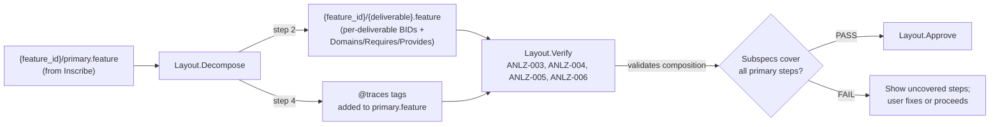

# Pipeline Diagrams

Diagrams are distributed across the directory READMEs they describe. This file serves as an index and holds reference material that spans multiple directories.

## Diagram Index

| Diagram | Location |
|---------|----------|
| Stage Flow | [stages/README.md](../stages/README.md#stage-flow) |
| Complete Pipeline | [stages/README.md](../stages/README.md#complete-pipeline) |
| Artifact Creation and Ingestion | [artifacts/README.md](../artifacts/README.md#artifact-creation-and-ingestion) |
| Inspection Artifact Flow | [automation/README.md](../automation/README.md#inspection-artifact-flow) |

---

## Artifact File Paths

Concrete paths for each artifact (substituting `{feature_id}` = `{YYYY-MM-DD}-{branch-slug}`):

| Artifact | Concrete path | Committed? |
|----------|--------------|------------|
| Decomposition | `.haileris/features/{feature_id}/decomposition.md` | Yes |
| Technical details | `.haileris/features/{feature_id}/technical-details.md` | Yes |
| Ascertainments | `.haileris/features/{feature_id}/ascertainments.md` | Yes |
| Primary spec | `tests/features/{feature_id}/primary.feature` | Yes |
| Subspecs | `tests/features/{feature_id}/{deliverable}.feature` | Yes |
| Delivery order | `.haileris/features/{feature_id}/delivery-order.yaml` | Yes |
| Source stubs | `src/` at `Domains:` paths (repo) | Yes |
| Red-phase tests | `tests/` (repo) | Yes |
| Green-phase implementation | `src/` (repo, within Etch stubs) | Yes |
| Implementation failure details | `.haileris/features/{feature_id}/verify_{timestamp}.md` | Yes |
| Project standards | `.haileris/project/standards.md` | Yes |
| Project test conventions | `.haileris/project/test-conventions.md` | Yes |
| Constitution | `.haileris/project/constitution.md` | Yes |
| Pipeline config | `.haileris/project/config.{ext}` | Yes |
| **Harvest inspection** | `.haileris/features/{feature_id}/harvest-inspection.yaml` | Yes |
| **Layout inspection** | `.haileris/features/{feature_id}/layout-inspection.yaml` | Yes |
| Etch map | `.haileris/features/{feature_id}/etch-map.yaml` | Yes |
| **Etch inspection** | `.haileris/features/{feature_id}/etch-inspection.yaml` | Yes |
| Realize map | `.haileris/features/{feature_id}/realize-map.yaml` | Yes |
| **Realize inspection** | `.haileris/features/{feature_id}/realize-inspection.yaml` | Yes |
| Harvest metadata | `.haileris/project/last-harvest.json` | Yes |
| Pipeline state | `.haileris/features/{feature_id}/pipeline-state.yaml` | Yes |

Inspection artifacts (bold) all converge at stage 7 (Inspect) as the **Traceability Gate**.

---

## Spec Composition Flow

Inscribe creates the primary spec. Layout decomposes it into subspecs and adds `@traces` tags. ANLZ-004 validates at Layout.Verify that subspecs compose back into the primary spec.

