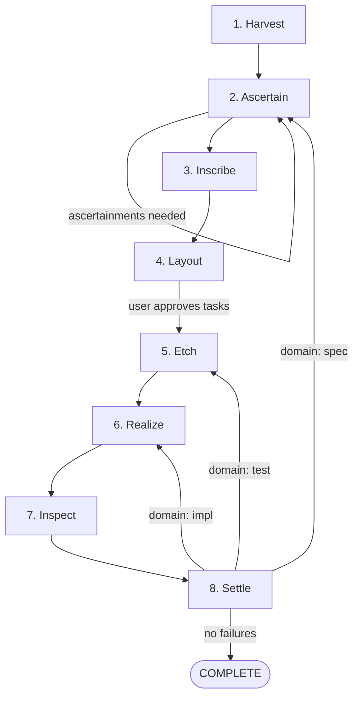
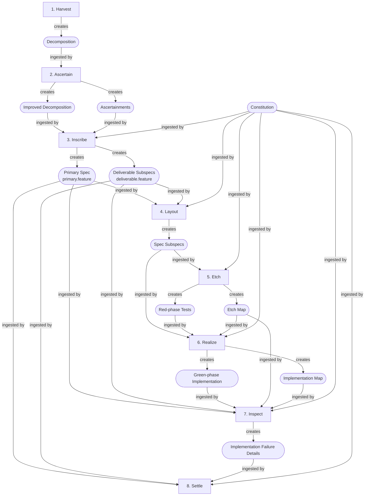
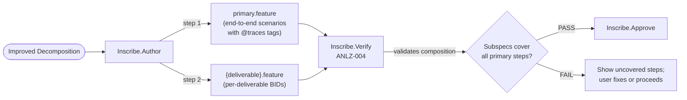
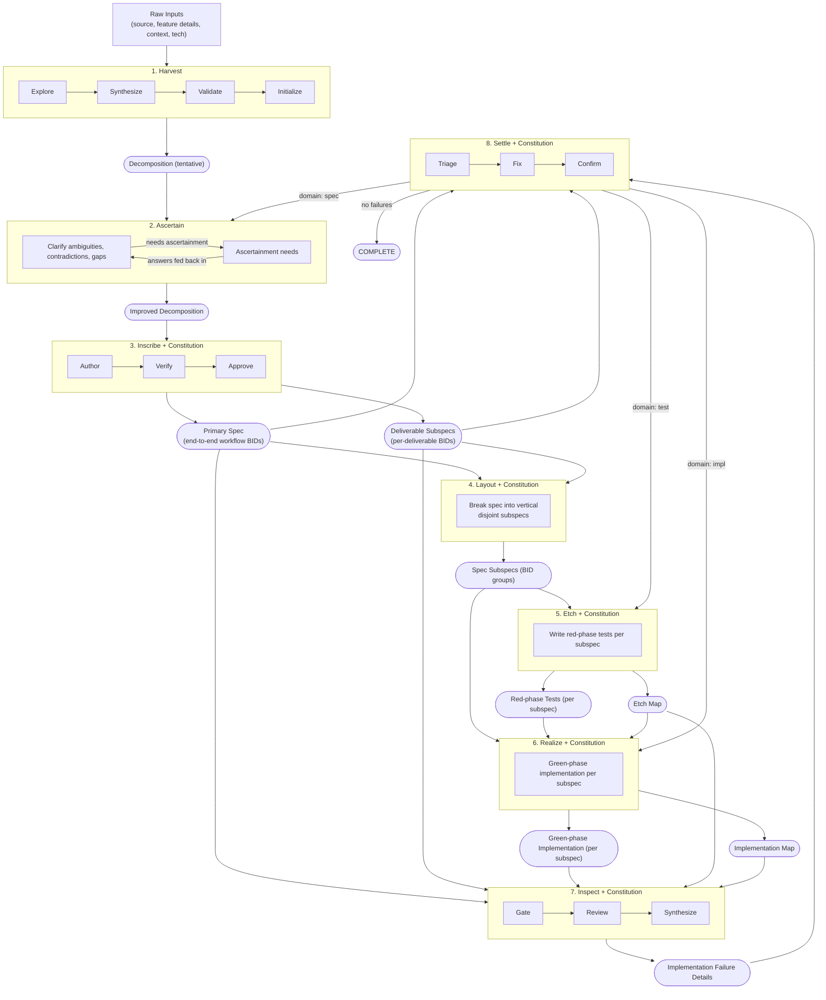
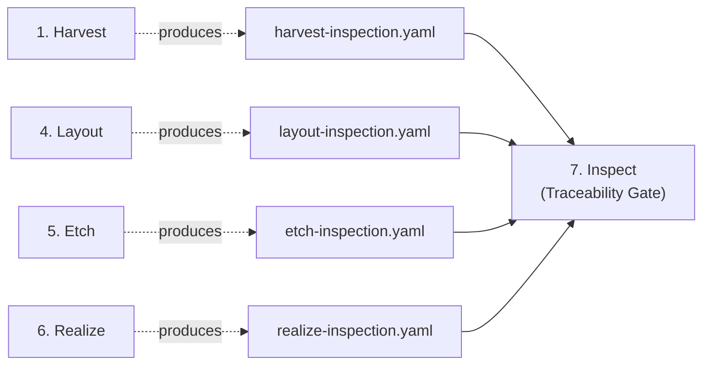

# Pipeline Diagrams

## 1. Stage Flow

---

## 2. Artifact File Paths

Concrete paths for each artifact (substituting `{id}` = `{YYYY-MM-DD}-{branch-slug}`):

| Artifact | Concrete path | Committed? |
|----------|--------------|------------|
| Decomposition | `.haileris/features/{id}/decomposition.md` | Yes |
| Technical details | `.haileris/features/{id}/technical-details.md` | Yes |
| Ascertainments | `.haileris/features/{id}/ascertainments.md` | Yes |
| Spec | `tests/features/` (repo) | Yes |
| Task list | `.haileris/features/{id}/tasks.md` | Yes |
| Red-phase tests | `tests/` (repo) | Yes |
| Green-phase implementation | `src/` (repo) | Yes |
| Implementation failure details | `.haileris/features/{id}/verify_{ts}.md` | Yes |
| Standards memory | `.haileris/project/standards.md` | Yes |
| Test conventions memory | `.haileris/project/test-conventions.md` | Yes |
| Constitution | `.haileris/project/constitution.md` | Yes |
| **Harvest inspection** | `.haileris/features/{id}/harvest-inspection.yaml` | Yes |
| **Layout inspection** | `.haileris/features/{id}/layout-inspection.yaml` | Yes |
| **Etch map** | `.haileris/features/{id}/etch-map.yaml` | Yes |
| **Etch inspection** | `.haileris/features/{id}/etch-inspection.yaml` | Yes |
| **Realize map** | `.haileris/features/{id}/realize-map.yaml` | Yes |
| **Realize inspection** | `.haileris/features/{id}/realize-inspection.yaml` | Yes |
| Pipeline state | `.haileris/features/{id}/pipeline-state.yaml` | Yes |

Inspection artifacts (bold) all converge at stage 7 (Inspect) as the **Traceability Gate**.

---

## 3. Artifact Creation and Ingestion

---

## 3a. Spec Composition Flow

Primary spec is authored first, then decomposed into subspecs. ANLZ-004 validates that subspecs compose back into the primary spec.

---

## 4. Complete Pipeline

---

## 5. Inspection Artifact Flow (Traceability Gate)

Each of stages 1, 4, 5, and 6 produces an inspection artifact. All four converge at stage 7 (Inspect) as the Traceability Gate — Inspect verifies BID coverage end-to-end before reviews begin.

### What each inspection verifies

| Inspection | Validates |
|-------|-----------|
| `harvest-inspection.yaml` | decomposition.md and technical-details.md across 4 dimensions: template compliance (×2), artifact preflight, dependency doc coverage |
| `layout-inspection.yaml` | task list BID coverage: MISSING / HALLUCINATED / DUPLICATED / INSUFFICIENT / PARTIAL |
| `etch-inspection.yaml` | etch-map.yaml BID → test mapping: MISSING / HALLUCINATED / DUPLICATED / INSUFFICIENT / PARTIAL |
| `realize-inspection.yaml` | implementation map: completeness (BID → derivation), scope (unmapped derivations via AST), broken refs (ghost derivations) |

Missing or `pass: false` on any inspection artifact = **Critical** finding at Inspect.

On-demand re-inspection is available for layout, etch, and realize inspections (all support `--fix` except realize).