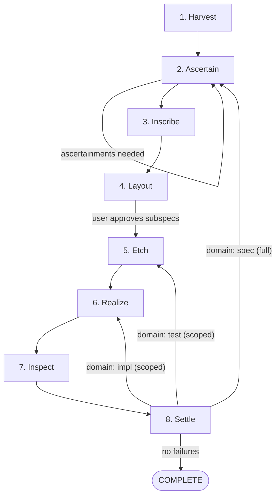
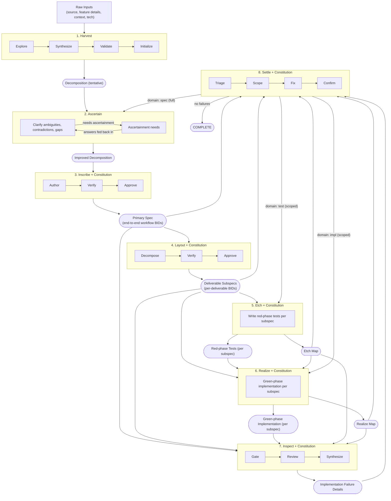

# Stage Specifications

Per-stage detail for each of the eight pipeline stages. Each spec defines the stage's inputs, process (with sub-stages), outputs, artifacts written, and inspection gates. Together they describe the full feature lifecycle from initial context gathering through final resolution.

## Stage Flow

## Stages

Stages execute in order. Each row links to the full spec, summarizes the stage's role, and lists its sub-stages.

| # | Stage | Purpose | Sub-Stages |
|---|-------|---------|------------|
| 1 | [Harvest](harvest.md) | Gather and validate project context, standards, and feature requirements | Explore, Synthesize, Validate, Initialize |
| 2 | [Ascertain](ascertain.md) | Clarify ambiguities, contradictions, and gaps in the decomposition | Iterative user-confirmation loop |
| 3 | [Inscribe](inscribe.md) | Author the primary Gherkin spec from the improved decomposition | Author, Verify, Approve |
| 4 | [Layout](layout.md) | Decompose the primary spec into ordered delivery subspecs | Decompose, Verify |
| 5 | [Etch](etch.md) | Write red-phase tests for each subspec | Per-subspec test generation, red-state confirmation |
| 6 | [Realize](realize.md) | Implement each subspec to make its red-phase tests pass | Per-subspec implementation in dependency order |
| 7 | [Inspect](inspect.md) | Review finished implementation against the spec and upstream inspections | Gate, Review (5 parallel reviews), Synthesize |
| 8 | [Settle](settle.md) | Resolve findings and gate on completeness | Triage, Scope, Fix, Confirm |

## Artifact Flow

Each stage reads artifacts from upstream and writes artifacts consumed downstream. The table below shows the primary artifacts each stage produces.

| Stage | Artifacts Written | Location |
|-------|-------------------|----------|
| Harvest | decomposition, technical-details, standards, test-conventions, constitution | `.haileris/features/`, `.haileris/project/` |
| Ascertain | ascertainments (Q&A outcomes) | `.haileris/features/` |
| Inscribe | primary.feature (Gherkin spec with BID tags) | `tests/features/{feature_id}/` |
| Layout | subspec .feature files, delivery-order.yaml | `tests/features/{feature_id}/`, `.haileris/features/` |
| Etch | integration + unit tests, etch-map.yaml | `tests/`, `.haileris/features/` |
| Realize | production code, realize-map.yaml | `src/`, `.haileris/features/` |
| Inspect | verify report | `.haileris/features/` |
| Settle | fixed code/tests/specs, updated ascertainments | Various |

## Inspection Gates

Five stages produce inspection artifacts that feed the traceability gate at Inspect. Each inspection is a machine-readable YAML report conforming to the schema in [inspection-reports.md](../artifacts/inspection-reports.md).

| Inspection | Stage | Checks |
|------------|-------|--------|
| [Harvest Inspection](../automation/harvest-inspection.md) | Harvest.Validate | 3 mechanical, 1 agent-evaluated |
| [Layout Inspection](../automation/layout-inspection.md) | Layout.Verify | 4 mechanical, 1 agent-evaluated |
| [Etch Inspection](../automation/etch-inspection.md) | Etch | 3 mechanical, 2 agent-evaluated |
| [Realize Inspection](../automation/realize-inspection.md) | Realize | 2 mechanical, 1 constraint-gated |
| [Traceability Gate](../automation/traceability-gate.md) | Inspect.Gate | 5 checks across all upstream inspections |

## Complete Pipeline

## Conventions

- Sub-stages use dot notation: `Stage.SubStage` (e.g., `Harvest.Explore`)
- Stage names are proper nouns: Harvest, Ascertain, Inscribe, Layout, Etch, Realize, Inspect, Settle
- Each stage spec follows the section order: Inputs, Process, Outputs (or Iteration), Artifacts Written, Inspection (if applicable), Notes
- Settle can trigger scoped re-runs of upstream stages (Etch, Realize, Inspect) based on failure domain triage and blast-radius analysis
